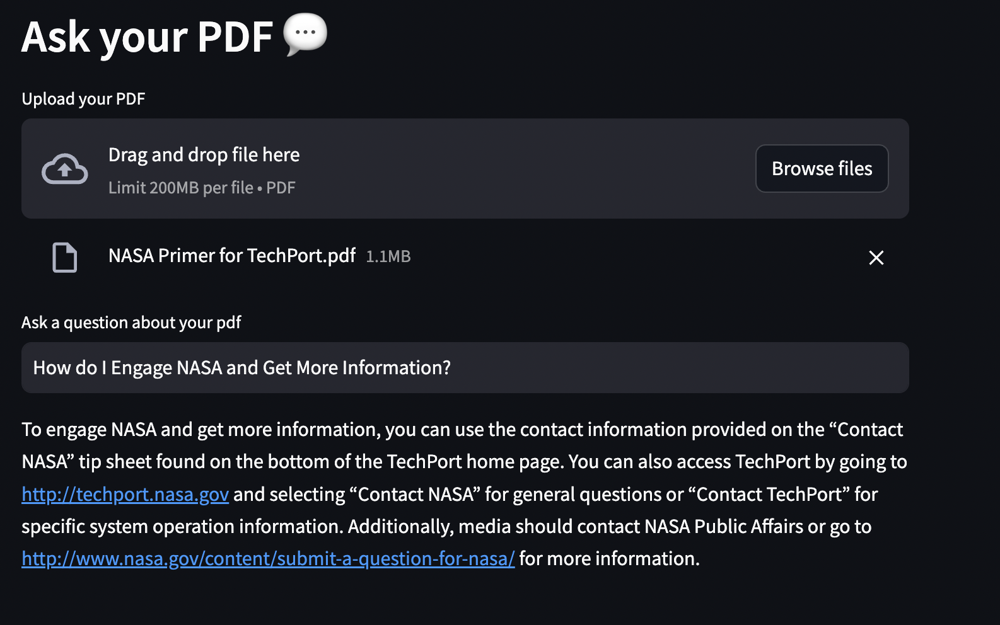

# Langchain PDF Bot

Langchain PDF Bot is a Streamlit-based application that allows users to upload a PDF, ask questions about its content, and receive AI-generated answers. Inspired by [Alejandro AO's video ](https://youtu.be/wUAUdEw5oxM), this application was created only for experimental purpose. It runs locally on the CPU(without requiring GPU) and is terribly slow. It utilizes [all-MiniLM-L6-v2](https://huggingface.co/sentence-transformers/all-MiniLM-L6-v2) for embeddings, and [Llama-2-7B-Chat-GGUF](https://huggingface.co/TheBloke/Llama-2-7B-Chat-GGUF) as LLM.



## Features

- **PDF Interaction:** Upload PDF documents and ask questions about their content.
- **Local Processing:** Utilizes the Llama-2-7B-Chat model for generating responses locally.
- **Interactive UI:** Streamlit interface for a user-friendly experience.

## Setup

1. Clone the repository:

   ```bash
   git clone https://github.com/soumyanjaleemahapatra/langchain-pdf-bot.git

2. Navigate to the project directory:
    ```bash
    cd langchain-pdf-bot

3. Install the required dependencies (preferably to venv):
    ```bash
    pip install -r requirements.txt

## Usage

1. Run the Streamlit application:
    ```bash
    streamlit run app.py

2. Access the application in your web browser at the provided URL.

3. Upload a PDF file, ask the question, wait patiently. You can check the terminal for insights into what is happening in the background.


